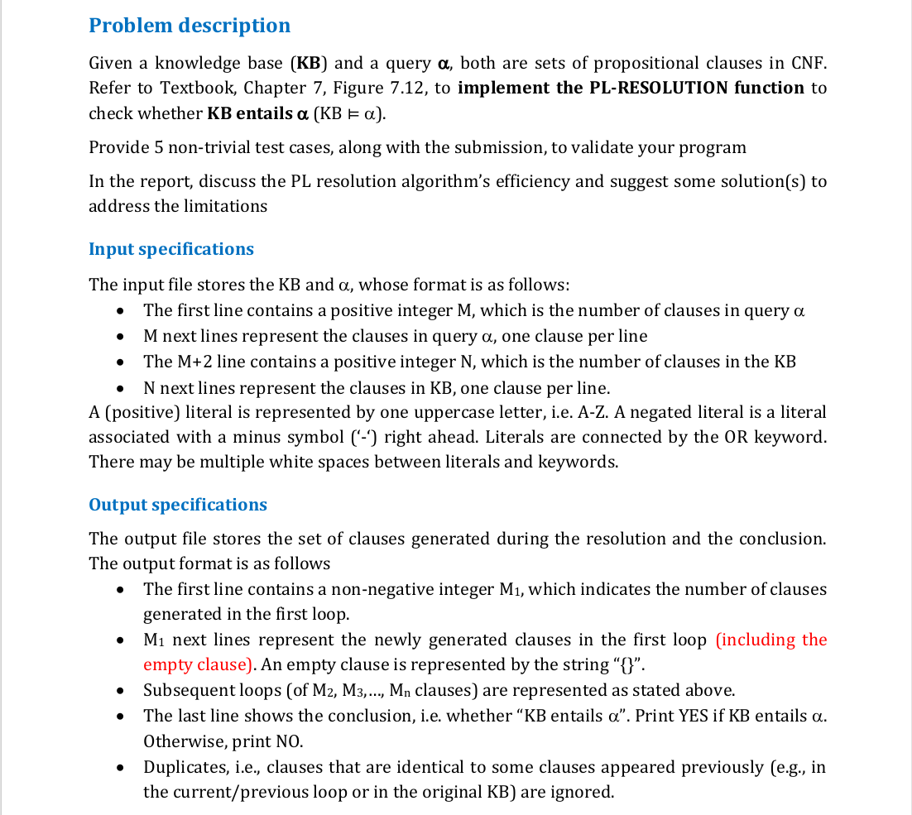
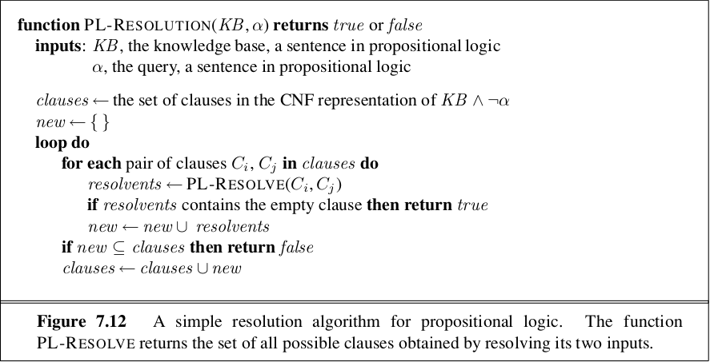
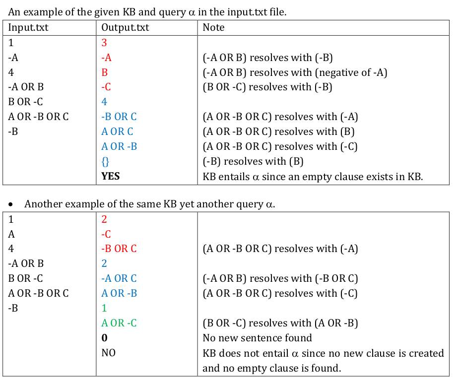
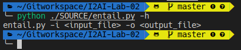
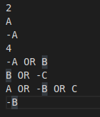
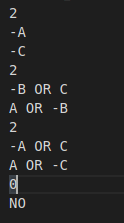
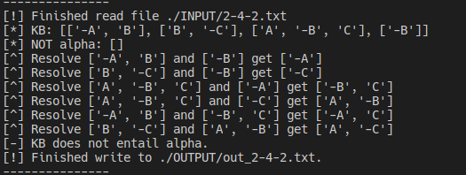
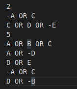
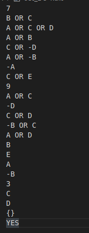
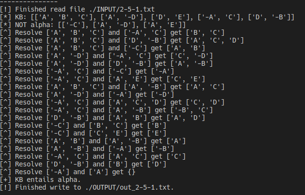

# Lab 02: PL Resolution

Courses `CSC14003`: Intro to Artificial Intelligence
`18CLC6`, `FIT - HCMUS`.
`06/09/2020`

This is an INDIVIDUAL assignment:
-   `18127231`: Đoàn Đình Toàn (GitHub: [@t3bol90](https://github.com/t3bol90))

---

## About this assignment:

|  |
| :----------------------------------------------------------: |
|                         **Problem**                          |

The `PL-RESOLUTION` function mention above:

|  |
| :----------------------------------------------------------: |
|                **PR-RESOLUTION pseudo code**                 |

There is some note for my implements of this function:

- The entailment is checked at the end of each loop, instead of after generating a clause. (In the `Important notes` of `statement` file).
- In my implementation, i merged the step write to file to `PL-RESOLUTION` function, due to assignment requirement. Because of if I split it into 2 functions, it's hard to construct the flow and deal with it (It lead to the situation that we need to call `PL-RESOLUTION` 2 times and the output write to file depend on the for loop of `PL-RESOLUTION` function). So, the function will write output to file and resolve the query $\alpha$ to `KB`.

|  |
| :----------------------------------------------------------: |
|                 **Sample input and output**                  |


## Progress Completeness


| Criteria                                                     | Points | Completeness |
| :----------------------------------------------------------- | :----: | :----------: |
| Read the input data and successfully store it in some data structures | 1.0pt  |     100%     |
| The output file strictly follows the lab specifications      | 1.0pt  |     100%     |
| Implement the propositional resolution algorithm             | 2.0pt  |     100%     |
| Provide a complete set of clauses and exact conclusion       | 3.0pt  |     100%     |
| Five test cases: both input and output files                 | 1.0pt  |     100%     |
| Discussion on the algorithm’s efffiency and suggestions      | 2.0pt  |     100%     |


## Assignment Plan

### Read input data and stored & output:

Firstly, the `INPUT` and `OUTPUT` folder is concrete. It's more convenient if  I have a `batch_test` for all test in `INPUT` folder and my program can get the input/output directory from program arguments.

|  |
| :----------------------------------------------------------: |
|            **The program take -i and -o as argv**            |

Then I read the data and stored clauses to `list` as ` clause data structure`. Each sentence is a list, so the `KB` and `alpha` is a `list` of sentences (`list`).

```python
def read_file(input_file):
    """
    :param: input_file: input file's directory
    :return: dnf alpha: list, KB: list
    """
```

I read alpha as `dnf form` because for entailment, you need to resolution `CNF` representation of $KB \and \neg \alpha$ .

Hence, I convert `dnf form` of `alpha` to `cnf form`  of`not alpha`.

```python
not_alpha = dnf_to_cnf(recursive_add([], alpha))
```

`recursive_add` is a `helper` function to convert `alpha` to set of clause in `dnf form`.

For the `input1.txt` in the sample, we get those printed lines in console:

```python
[!] Finished read file ./INPUT/1-4-2.txt
[*] KB: [['-A', 'B'], ['B', '-C'], ['A', '-B', 'C'], ['-B']]
[*] NOT alpha: [['A']]
```

 For `batch test`, I wrote a shell script:

```bash
for file in ./INPUT/*
do
  echo "---------------"
  python ./SOURCE/entail.py -i $file -o "./OUTPUT/out_`basename "$file"`"
  echo "---------------"
done
```

Taaaada, then the testing step is more convenient.

### Implement the propositional resolution algorithm:

I implemented it exactly the same as the pseudo code in textbook[^(1)].

```python
def PL_RESOLUTION(negative_alpha, KB, output_file):
    """
    Check if KB entails alpha and write to output_file
    """
    with open(output_file, "w") as fout:
        clauses = KB
        for c in negative_alpha:
            clauses.append(c)
        is_entailed = False
        while True:
            new_clauses = []
            num_of_res = 0
            string_write = ""
            for i in range(len(clauses)-1):
                for j in range(i+1,len(clauses)): 
                    new_clause = resolve(clauses[i], clauses[j])
                    new_clause = trim(new_clause)
                    # print(num_of_res,clauses[i], "+", clauses[j], "=",new_clause) #$
                    if new_clause == [] or (new_clause in clauses) or new_clause in new_clauses or is_equivalent(new_clause):
                        continue
                    if new_clause == "{}":  # New clause is dump
                        is_entailed = True
                    string_write += to_string(new_clause) if new_clause != '{}' else '{}\n'
                    print('[^] Resolve',clauses[i], "and", clauses[j], "get",new_clause)
                    num_of_res += 1
                    new_clauses.append(new_clause)
            string_write = str(num_of_res) + "\n" + string_write
            fout.write(string_write)
            if new_clauses == []:  # Can not resolve new clause.
                string_write += "0\nNO"
                fout.write("NO")
                return False
            elif is_entailed:
                string_write += "\nYES"
                fout.write("YES")
                return True
            clauses += new_clauses  # Add new clause to KB
```

By resolve, we get this in console:

```bash
[^] Resolve ['-A', 'B'] and ['-B'] get ['-A']
[^] Resolve ['-A', 'B'] and ['A'] get ['B']
[^] Resolve ['B', '-C'] and ['-B'] get ['-C']
[^] Resolve ['A', '-B', 'C'] and ['-A'] get ['-B', 'C']
[^] Resolve ['A', '-B', 'C'] and ['B'] get ['A', 'C']
[^] Resolve ['A', '-B', 'C'] and ['-C'] get ['A', '-B']
[^] Resolve ['-B'] and ['B'] get {}
```

Then the conclusion:

```python
[+] KB entails alpha.
```

Write to file:

```bash
[!] Finished write to ./OUTPUT/out_1-4-2.txt.
```

The hole message for a test look like that:

```bash
[!] Finished read file ./INPUT/1-4-2.txt
[*] KB: [['-A', 'B'], ['B', '-C'], ['A', '-B', 'C'], ['-B']]
[*] NOT alpha: [['A']]
[^] Resolve ['-A', 'B'] and ['-B'] get ['-A']
[^] Resolve ['-A', 'B'] and ['A'] get ['B']
[^] Resolve ['B', '-C'] and ['-B'] get ['-C']
[^] Resolve ['A', '-B', 'C'] and ['-A'] get ['-B', 'C']
[^] Resolve ['A', '-B', 'C'] and ['B'] get ['A', 'C']
[^] Resolve ['A', '-B', 'C'] and ['-C'] get ['A', '-B']
[^] Resolve ['-B'] and ['B'] get {}
[+] KB entails alpha.
[!] Finished write to ./OUTPUT/out_1-4-2.txt.
```

For `input2.txt`:

```bash
[!] Finished read file ./INPUT/1-4-3.txt
[*] KB: [['-A', 'B'], ['B', '-C'], ['A', '-B', 'C'], ['-B']]
[*] NOT alpha: [['-A']]
[^] Resolve ['B', '-C'] and ['-B'] get ['-C']
[^] Resolve ['A', '-B', 'C'] and ['-A'] get ['-B', 'C']
[^] Resolve ['-A', 'B'] and ['-B', 'C'] get ['-A', 'C']
[^] Resolve ['A', '-B', 'C'] and ['-C'] get ['A', '-B']
[^] Resolve ['B', '-C'] and ['A', '-B'] get ['A', '-C']
[-] KB does not entail alpha.
[!] Finished write to ./OUTPUT/out_1-4-3.txt.
```

The `trim` method for sort clause as alphabetical order and remove duplicated literals.

```python
def trim(clause):
    """
    Bubble sort for clause - by alphabet
    :param clause:
    :return: sorted clause
    """
```

The `resolve` method take 2 clauses as parameters and return new clause (new clause can be null/empty):

```python
def resolve(clause_A, clause_B):
    """
    :param clause_a: clause
    :param clause_b: clause
    :return: res as resolved clause of 2 param
    """
```

The `is_equivalent` method is a checker for this condition:

```python
def is_equivalent(clause):
    """
    The clause [A,B,-B] is considered equivalent to [A,True] and hence equivalent to True.
    Deducing that True is true is not very helpful.
    Therefore,any clause in which two complementary literals appear can be discarded.
    :return: True if clause is useless 
    """
```

### Test scenarios:

|                            INPUT                             |                            OUTPUT                            | LOG                                                          | COMMENT                                                      |
| :----------------------------------------------------------: | :----------------------------------------------------------: | ------------------------------------------------------------ | ------------------------------------------------------------ |
|  |  |  | This test case show that alpha is  False sentence, hence the KB can't resolve alpha. |
|  |  |  | The not alpha contain a set is a subset of another set in clauses. So in `CNF` form, you need to reduce it. |

And there are 12 test cases (ignored 2 samples) I've generated (few of them I looted from my friend scenarios/bugs) with. There are in `INPUT` and `OUTPUT` folder.  There are non-trivial test, each of them has different scenario. For example: In test `1-6-1`

```bash
1
-R
6
P OR -Q
-P OR R OR S
Q
-P OR -R
Q OR P OR R
-Q OR S

```


```bash
9
-Q OR R OR S
P
-Q OR -R
P OR R
-P OR S
Q OR R OR S
S
-P
P OR R OR S
8
-Q
R OR S
-P OR -Q OR S
-R
-P OR Q OR S
Q OR R
{}
P OR -Q OR S
YES
```

Because of the rules:

> The entailment is checked at the end of each loop, instead of after generating a clause. (In the `Important notes` of `statement` file).

So we need to resolve more times till we have hit the condition to end.

At the main directory, just:

```bash
chmod +x ./batch_test.sh
./batch_test.sh
```

Then it will automatically run a batch of all input file in `INPUT` folder.

## Discussion & suggestions:

In order to improve the reasoning efficiency of the resolution principle in propositional logic, in the  purpose of reducing the size of clause set and eliminating the number of literal in clause set as soon as possible. `CNF` form is one of multiple solutions. Because of the  input/output format rules of this assignment, I do not try to implement a different resolution algorithms. 

PL-RESOLUTION end when it hit a complementary literals/empty clause ({}). Because the empty clause is get by a complementary pair, this complementary pair respectively are get by the addition of complementary pair, therefore, in turn, the rapid reduction of the literal in clause set is helpful to get the empty clause. And the first resolution of the literal of the least complementary pair, we can remove a literal by a relatively minimal resolution step. The less to the literal, the easier to get the empty clause.  I've several document about efficiency of PL-Resolution, in this paper[^(3)], it concludes that if you follow the strategies, priority resolve the related resolve of  previous step, the empty set come faster than normal algorithms. 

Hence, the book caption about completeness of PL-RESOLUTION because the clauses is finite. But there is no complexity bound for this algorithms[^(4)], it's `NP`. So in a large test/clauses, it should be a different method.


## References:

[^(1)]: https://www.amazon.com/Artificial-Intelligence-Modern-Approach-3rd/dp/0136042597
[^(3)]: https://ieeexplore.ieee.org/document/8004925

[^(4)]: https://www.math.ucsd.edu/~sbuss/ResearchWeb/marktoberdorf97/paper.pdf

- [Standford's logic course](http://intrologic.stanford.edu/notes/chapter_12.html)
- [Cheng-Lin-Li's AIMA course note](https://github.com/Cheng-Lin-Li/AI)

****
<center><b> Have a Great Day </b></center>